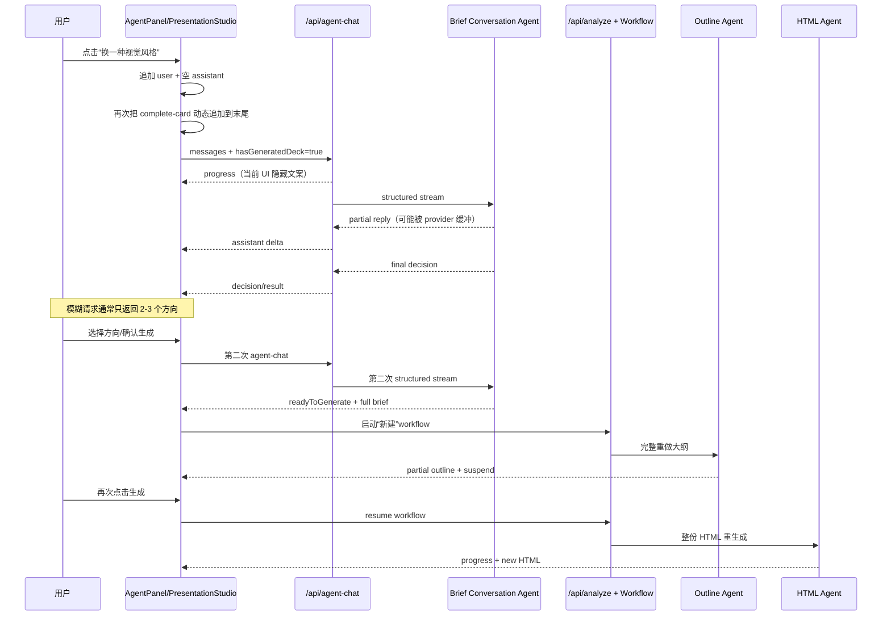
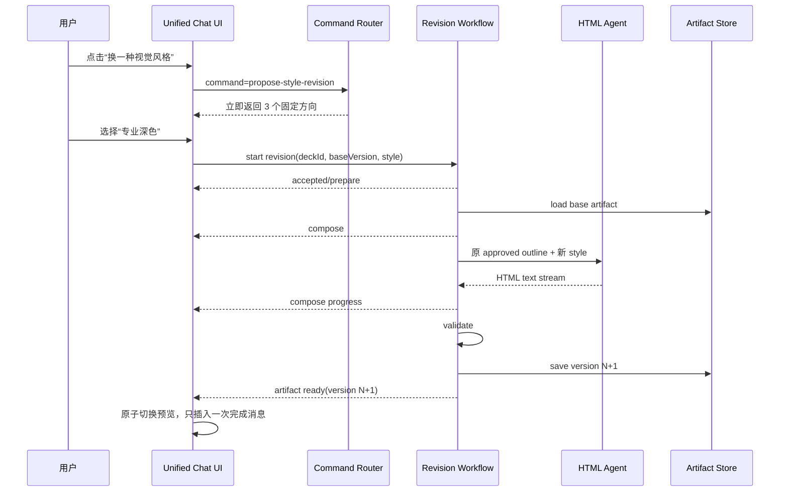

# Agent Chat 全链路交互体验改造方案

## 1. 文档目的

本文基于 2026-07-10 当前代码，梳理用户从右侧聊天面板发出请求，到 Mastra agent 判断意图、workflow 生成大纲/HTML、左侧预览更新的完整链路，并针对以下两个已复现问题给出分阶段改造方案：

1. 已生成演示文稿后，点击「换一种视觉风格」，消息流底部错误地再次出现「已生成 8 页演示文稿，预览在左侧……」。
2. `/api/agent-chat` 请求可持续接近两分钟，期间只有三点 loading，用户看不到有效阶段、耗时预期、取消入口或降级反馈。

本文只输出方案，不修改业务代码。`docs/08-Agent-Chat流式体验问题技术改造计划.md` 中的 assistant delta、snapshot、AbortController 已经在当前代码落地，本文把它们视为现状，重点解决落地后仍存在的问题。

---

## 2. 结论摘要

当前问题不是单一的“模型慢”，而是 UI 消息建模、意图路由、模型配置、生成工作流和流协议共同造成的。

| 优先级 | 根因 | 当前表现 | 结论 |
| --- | --- | --- | --- |
| P0 | 完成消息是每次 render 动态追加的派生消息 | 新用户消息和 loading 后面再次出现「已生成 N 页」 | 这是确定的前端消息排序缺陷，不是模型重复输出 |
| P0 | streaming assistant 存在时，`progressMessage` 被条件隐藏 | 服务端发了「正在思考回复」，UI 仍只有三点 | 当前进度事件实际上不可见 |
| P0 | 快捷 chip 被当作普通自然语言交给 LLM | 点击「换一种视觉风格」也要等待一次完整结构化模型调用 | 明确的产品命令不应先经过开放式 agent 判断 |
| P0 | provider 解析会把未知值静默回退到 `openrouter` | `.env` 的 `grsai` 实际按 `openrouter/...` 构造模型 ID，并指向 `grsaiapi.com` | 模型路由与结构化流兼容性不可验证，必须先校正并观测 |
| P1 | 已生成文稿的修改仍复用“新建文稿”逻辑 | 确认修改后重新生成 brief、大纲，再等待人工批准，再生成整份 HTML | 风格修改缺少 revision workflow，做了不必要的工作 |
| P1 | agent 只收到最近聊天文本和 `hasGeneratedDeck` 布尔值 | 不知道当前 artifact、完整 brief、大纲和版本 | revision 容易丢上下文或改错对象 |
| P1 | agent chat 与 workflow 使用两套流协议、两份状态 | NDJSON + AI SDK UI stream 并存，`chatMessages` + `useChat.messages` 并存 | 状态顺序、取消、错误和完成消息难以保持一致 |
| P1 | workflow 没有把取消信号继续传到内部 agent stream | 前端 stop 后，上游模型可能仍继续生成 | 取消只停止 UI 请求，不一定停止成本和后台执行 |
| P1 | 超时预算互相冲突 | UI watchdog 240 秒，HTML idle 240 秒，总超时 420/480 秒 | UI 可能先报错，但服务端仍认为任务合法运行中 |

最先应做的不是增加更多 loading 文案，而是：

1. 修复消息顺序和进度可见性。
2. 让快捷命令走确定性路由，消除一次无意义的 LLM 往返。
3. 校正 provider/model 解析并量化首 token、fallback 和总耗时。
4. 为已生成文稿建立专用 revision workflow，风格修改复用已批准大纲。
5. 最终将所有可见消息和工作流事件收敛为一条有序事件流。

---

## 3. 当前全链路

### 3.1 前端入口

入口文件：

- `src/components/presentation-studio/agent-panel.tsx`
- `src/components/presentation-studio/presentation-studio.tsx`

当前调用顺序：

1. `AgentPanel` 在 `previewing` 阶段展示三个 chip：
   - 整体更简洁
   - 换一种视觉风格
   - 修改配色
2. 点击 chip 后，`sendPrompt()` 把文本原样交给 `onSend()`。
3. `PresentationStudio.handleAgentSend()` 立即追加 user message 和一个空的 streaming assistant message。
4. `sendToAgentChat()` POST `/api/agent-chat`，请求体包含：
   - 过滤后的最近聊天文本
   - `hasGeneratedDeck`
   - 两个已被服务端忽略的 legacy session/run 字段
5. 前端逐行解析 NDJSON，处理 `progress`、`assistant-delta`、`assistant-snapshot`、`decision`、`result`、`error`。

### 3.2 `/api/agent-chat`

入口：`src/app/api/agent-chat/route.ts`。

当前执行顺序：

1. Zod 校验消息数组。
2. 截取最近 20 条文本消息。
3. 如果已有文稿，在历史开头插入一条 system message，告诉 agent 当前是 revision 对话。
4. 发送一个 `progress: 正在思考回复...` 事件。
5. 调用 `presentationBriefConversationAgent.stream()`，要求结构化输出：

```ts
{
  reply: string;
  readyToGenerate: boolean;
  brief: PresentationBrief | null;
}
```

6. 从 `objectStream` 的 partial `reply` 提取 assistant delta。
7. 等待 `stream.object` 得到最终决策。
8. 如果结构化流失败，再发起一次普通文本 JSON stream，并在结束后解析。
9. 服务端用正则再次校验用户是否明确确认生成。
10. 依次发送 `assistant-snapshot`、`decision`、兼容用 `result`，然后关闭响应。

### 3.3 新建生成工作流

当 `readyToGenerate && brief` 为真时，前端调用 `startGenerationFromBrief()`：

1. 如果本地已有 brief，先 `resetWorkflow()`。
2. 把 agent brief 转成 `PresentationBrief`。
3. 调用 `usePresentationWorkflow.sendAgentRequest()`。
4. `useChat` 通过 `/api/analyze` 发起第二条独立请求。
5. `/api/analyze` 创建 `presentationGenerationWorkflow` run，并用 AI SDK UI stream 返回 workflow 事件。

workflow 包含两个串行步骤：

```text
presentation-outline-suggestion-step
  -> suspend 等待用户批准大纲
  -> presentation-html-generation-step
```

大纲步骤：

1. 调用 `presentationOutlineSuggestionAgent.stream()` 获取结构化大纲。
2. 每 12 秒发送一次 heartbeat；收到 partial object 时发送 partial outline。
3. 首次结构化更新最多等待 60 秒，流中断后可等待 180 秒。
4. 结构化模式失败时，再调用一次严格 JSON fallback。
5. 大纲完成后 suspend，等待用户点击「生成演示文稿」。

HTML 步骤：

1. 读取 `.claude/skills/frontend-slides` 的多个完整说明文件。
2. 把 skill、模板、CSS、动画说明、style presets、完整大纲拼成一个大 prompt。
3. 调用 `frontendSlidesComposerAgent.stream()` 生成整份 standalone HTML。
4. 每累计约 800 个字符写一次进度。
5. 校验 slide 数量和 HTML 完整性。
6. 保存新 HTML 文件并返回 URL。

### 3.4 已生成文稿后的 revision 实际路径

当前没有 revision workflow。用户要求修改时仍然进入 `/api/agent-chat`：

```text
用户修改请求
  -> conversation agent 判断是否明确
  -> 模糊请求：返回选项，等待下一轮
  -> 用户选择/确认
  -> 生成新的 full brief
  -> 重置旧 workflow
  -> 重新生成完整大纲
  -> 再次等待大纲批准
  -> 重新生成完整 HTML
```

因此「换个视觉风格」即使不修改内容，也会付出一次意图 agent、一次完整大纲 agent、一次人工批准、一次完整 HTML agent 的成本。

### 3.5 当前时序图



---

## 4. 截图问题的确定根因

### 4.1 「已生成 N 页」重复并错位

`PresentationStudio` 没有在生成完成时把完成消息写入有序消息历史，而是在每次 render 时根据 `phase === "previewing"` 构造固定 ID 的 `complete-card`：

- `src/components/presentation-studio/presentation-studio.tsx:412-449`
- `src/components/presentation-studio/presentation-studio.tsx:462`

渲染顺序是：

```ts
const agentMessages = [...chatMessages, ...systemMessages];
```

点击 chip 后，新的 user message 和 streaming assistant 已经进入 `chatMessages`，而 `complete-card` 仍被追加在数组最后，所以视觉顺序变成：

```text
用户：换一种视觉风格
助手：...
系统：已生成 8 页演示文稿，预览在左侧……
```

这与截图完全一致。它不是 agent 回复，也没有进入 `textHistory()`；是 UI 把一个“当前 artifact 状态”错误地当成“本轮新消息”重复插到末尾。

### 4.2 服务端 progress 已发送，但用户看不到

`handleAgentSend()` 总会先插入一个 `isStreaming: true` 的空 assistant message。`AgentPanel` 只有在“不存在 streaming assistant message”时才渲染带 `progressMessage` 的 loading 行：

- `src/components/presentation-studio/agent-panel.tsx:303-311`
- `src/components/presentation-studio/agent-panel.tsx:319-328`

这两个条件互斥，导致服务端发出的：

- 正在思考回复
- 结构化回复失败，正在重试普通文本解析

通常都不会显示，用户只看到空 assistant 气泡里的三点动画。

### 4.3 当前流式实现无法保证快速首文本

当前 assistant 文本来自 structured `objectStream.reply`。不同 provider 可能：

- 不输出 partial object，只在完整 JSON 结束时给最终对象。
- 长时间 reasoning 后才开始写 `reply` 字段。
- 对自定义 OpenAI-compatible endpoint 的 structured output 支持不完整。
- 首次结构化调用失败后再执行第二次 fallback，使等待时间近似相加。

所以“代码用了 stream”不等于“用户一定能尽快看到文本”。必须分别测量首响应字节、首模型 delta、最终 decision 和 fallback 耗时。

### 4.4 provider/model 配置存在静默错配

当前 `.env` 的非敏感配置状态：

```text
MODEL_PROVIDER=grsai
PRESENTATION_BRIEF_PROVIDER=(unset)
PRESENTATION_OUTLINE_PROVIDER=grsai
PRESENTATION_HTML_PROVIDER=grsai
MODEL_BASE_URL_HOST=grsaiapi.com
```

但 `src/utils/model-provider.ts` 只显式识别：

- `openrouter`
- `openai`
- `google`
- `openai-compatible`

其他值都会静默返回 `openrouter`。同时 agent 调用只传各自的 `PRESENTATION_*_PROVIDER`，不会读取全局 `MODEL_PROVIDER`。因此：

1. brief agent 未配置 provider，默认走 `openrouter`。
2. outline/html 的 `grsai` 也被当成 `openrouter`。
3. 最终模型配置是 `openrouter/<model>`，但 URL 指向 `grsaiapi.com`。

本地 Mastra provider registry 的 OpenRouter 列表中没有当前默认的 `gemini-3.5-flash`；它列出了 `google/gemini-2.5-flash`、`openai/gpt-4.1-mini`、`openai/gpt-5-mini` 等。这不能证明 GRS endpoint 不支持当前模型，但证明当前配置没有经过与实际 provider 身份一致的验证。

### 4.5 快捷 chip 的语义已经确定，却仍调用 agent

「换一种视觉风格」是产品定义的命令，不是开放式自然语言。系统已经知道下一步应该让用户选择 2-3 个风格方向。当前却让模型重新得出同一个结论，造成：

- 一次不必要的网络排队和模型推理。
- provider 故障直接影响基础 UI 操作。
- 每次选项文案可能不一致。
- 用户点击后无法获得即时反馈。

### 4.6 revision 缺少 artifact 上下文

agent chat 只收到最近 20 条纯文本和 `hasGeneratedDeck: true`。它没有收到：

- 当前 deck ID 和 version。
- 当前 brief。
- 已批准 outline。
- 当前 style/design guidance。
- 当前 HTML URL。
- 用户要修改的基线版本。

`frontendSlidesSessionId`、`frontendSlidesRunId` 仍在前端发送，但服务端已经明确忽略。`interactiveResult` 和 `data.done/html` 也是旧链路兼容状态，当前 Mastra agent-chat 不会返回这些字段。遗留状态让真实数据所有权更模糊。

### 4.7 两条流和两份状态造成一致性问题

当前同时存在：

| 用途 | 协议 | 前端状态 |
| --- | --- | --- |
| 对话/意图判断 | 自定义 NDJSON | `chatMessages`、`isAgentReplying`、`agentProgressMessage` |
| 大纲/HTML workflow | AI SDK UI message stream | `useChat.messages`、`status`、workflow data parts |
| UI 阶段/系统卡 | 本地派生 | `phase`、`systemMessages` |

完成消息错位就是这种多状态源的直接结果。其他风险包括：

- agent decision 已结束但 workflow 还没开始时，UI phase 仍是旧值。
- reset workflow 会立即清掉旧 HTML，revision 失败时没有可回退 artifact。
- `AgentPanel` 自动滚动只依赖 `messages.length` 和 `isSending`，delta 增长不改变数组长度，长回复可能不会持续跟随到底部。
- client stop 与 workflow run 的取消语义不一致。

### 4.8 超时和取消没有贯穿调用链

当前关键超时：

| 环节 | 当前值 |
| --- | --- |
| `/api/agent-chat` route maxDuration | 300 秒 |
| 大纲总超时 | 300 秒，生产环境乘 1.5 |
| 大纲首更新 | 60 秒，生产环境乘 1.5 |
| HTML 总超时 | 480 秒，生产环境乘 1.5 |
| frontend-slides 总超时 | 420 秒，生产环境乘 1.5 |
| HTML stream idle | 240 秒，生产环境乘 1.5 |
| 前端 HTML watchdog | 240 秒，不乘环境系数 |

`/api/agent-chat` 已把 `request.signal` 传给 agent stream，这是正确的。但 workflow step 虽能获得 `abortSignal`，当前 outline/HTML agent stream 没有使用它；`/api/analyze` 也没有把 request abort 显式关联到 workflow run abort。结果可能是 UI 停止读取后，模型仍继续生成。

---

## 5. Mastra 能力与选型原则

### 5.1 本地版本依据

当前安装版本：

- `@mastra/core@0.24.9`
- `@mastra/ai-sdk@0.3.3`
- `@mastra/memory@0.15.13`
- `ai@5.0.97`

按 `$mastra` 技能要求优先查本地 embedded docs。当前 `@mastra/core` 包没有 `dist/docs/`，因此以本地 README 和类型定义为准：

- `Agent.stream()`：当前推荐名称，`streamVNext()` 已 deprecated。
- `stream.objectStream`：可消费 partial structured output。
- `stream.object`：可获得最终结构化结果。
- `abortSignal`：agent execution option 支持取消。
- workflow run 支持 `stream()`、`resumeStream()` 和 writer data chunks。
- `@mastra/ai-sdk` 推荐用 `toAISdkFormat()` 转换 agent/workflow stream，再交给 AI SDK UI stream。
- Mastra 已启用默认 observability，但应用日志还缺少贯穿 chat turn 和 workflow run 的 correlation ID 与关键耗时点。

### 5.2 Agent 与 Workflow 的职责边界

根据 Mastra 的核心选型原则：

- Agent 用于开放式任务：理解自由文本、澄清模糊意图、提出内容/设计建议。
- Workflow 用于定义明确的多步流程：生成大纲、等待审批、生成 HTML、校验、保存、发布版本。

因此目标架构不应让 agent 决定每一个 UI 动作：

| 用户动作 | 推荐处理方式 |
| --- | --- |
| 点击「换一种视觉风格」 | 前端/服务端确定性 command router，立即展示固定风格选项 |
| 点击某个风格选项 | 明确的 revision command，直接启动 workflow |
| 输入「我不太喜欢，感觉有点普通」 | conversation/revision agent 澄清并提出方向 |
| 输入「第 3 页改成客户案例，并用深色科技风」 | revision agent 提取结构化修改计划，再交给 workflow |
| 生成、校验、保存、发布新 HTML | revision workflow |

---

## 6. 目标体验

### 6.1 点击「换一种视觉风格」

目标流程：

1. 点击后 100ms 内把用户动作写入消息历史。
2. 不调用 LLM，立即显示三个可选方向，例如：
   - 现代清爽
   - 专业深色
   - 高对比科技
3. 用户点击某个方向即代表明确确认，不再要求回复「确认生成」。
4. 立即创建 revision operation，保留左侧旧预览。
5. 左侧显示真实阶段：准备修改、重绘页面、校验、保存新版本。
6. 新版本成功后原子切换预览，并只插入一次完成消息。
7. 失败或取消时继续显示旧版本，可重试，不出现空白预览。

### 6.2 自由文本修改

目标流程：

1. 用户消息立即回显。
2. 500ms 内收到服务端 accepted/status 事件。
3. 正常情况下 2-3 秒内出现首段有效 assistant 文本。
4. 超过 3 秒仍无模型文本时，气泡内显示真实状态而不是只有三点。
5. 超过 8 秒时显示「响应较慢」和取消/重试入口。
6. 模糊请求只进行澄清，不启动生成。
7. 明确请求或明确选择直接进入对应 revision workflow。

### 6.3 可量化 SLO

| 指标 | 目标 |
| --- | --- |
| 用户消息/快捷命令回显 | P95 <= 100ms |
| 服务端首响应字节 | P95 <= 500ms |
| 确定性 chip 的下一步 UI | P95 <= 100ms，不调用模型 |
| agent 首个有效文本 | P95 <= 3s，P99 <= 8s |
| agent-chat 总耗时 | P95 <= 15s，硬超时 30s |
| 长任务首个 workflow 状态 | P95 <= 1s |
| 长任务状态最大静默间隔 | <= 10s |
| 取消 UI 确认 | <= 1s |
| 完成消息重复数 | 0 |
| revision 失败后的旧预览可用性 | 100% |

这些是产品 SLO，不等同于服务端允许的最大执行时间。HTML 总生成可以更久，但必须有可验证的阶段事件、取消能力和旧版本兜底。

---

## 7. 目标架构

### 7.1 单一有序事件流

目标态只保留一条前端可见事件流。所有事件都带：

```ts
type OperationMeta = {
  operationId: string;
  sequence: number;
  deckId?: string;
  baseVersion?: number;
  targetVersion?: number;
  workflowRunId?: string;
};
```

推荐的 AI SDK UI data parts：

```ts
type PresentationDataParts = {
  agentStatus: {
    stage: "accepted" | "understanding" | "planning" | "retrying";
    label: string;
    elapsedMs?: number;
  } & OperationMeta;
  agentDecision: {
    action: "respond" | "propose-revision" | "start-new" | "start-revision";
    revisionKind?: "style" | "palette" | "content" | "structure" | "mixed";
    proposal?: RevisionSpec;
  } & OperationMeta;
  workflowProgress: {
    stage: "prepare" | "revise-outline" | "compose" | "validate" | "save";
    label: string;
    progress?: number;
  } & OperationMeta;
  artifact: {
    status: "ready";
    htmlUrl: string;
    version: number;
  } & OperationMeta;
  operationError: {
    code: string;
    retryable: boolean;
    message: string;
  } & OperationMeta;
};
```

assistant 文本仍使用标准 text start/delta/end；业务决策和 workflow 状态使用 data parts。前端 reducer 按 `operationId + sequence` 去重和排序，不再把当前 phase 临时拼成历史消息。

### 7.2 Artifact 与 revision 上下文

服务端需要持有可寻址的 deck artifact：

```ts
type DeckArtifact = {
  deckId: string;
  version: number;
  brief: PresentationBrief;
  approvedOutline: PresentationOutlineData;
  style: string;
  designGuidance: string[];
  htmlUrl: string;
  createdAt: string;
};
```

聊天请求只发送 `deckId/baseVersion` 和用户输入，服务端加载权威上下文。不要在每轮聊天里重复发送整份 HTML；也不要只发送 `hasGeneratedDeck: boolean`。

新 revision 在成功前写到 `targetVersion = baseVersion + 1`。只有校验和保存成功后，前端才把 active artifact 从旧版本切换到新版本。

### 7.3 Revision workflow

新增独立的 `presentationRevisionWorkflow`，而不是复用新建 workflow 的完整路径：

```text
load-base-artifact
  -> normalize-revision-spec
  -> branch by revisionKind
       style/palette: reuse approved outline
       content/structure/mixed: revise outline, optionally suspend for review
  -> compose-html
  -> validate-html
  -> save-new-version
  -> publish-artifact
```

分支规则：

| revision 类型 | 是否重做大纲 | 是否再次审批 | HTML 处理 |
| --- | --- | --- | --- |
| style | 否 | 否，用户选择风格即确认 | 用原大纲 + 新 style 重生成 |
| palette | 否 | 否 | 优先局部样式变换；不可靠时整份重生成 |
| content，单页明确修改 | 只更新目标 slide outline | 默认不审批，可提供变更摘要 | 生成新版本 |
| structure，增删/重排页面 | 是 | 是 | 审批后生成 |
| mixed | 是 | 视影响范围 | 审批后生成 |

首版可以继续整份生成 HTML，不必立即实现 DOM patch；真正的性能收益先来自跳过 conversation LLM、大纲重做和重复审批。后续再评估 CSS token 化或基于结构化 slide AST 的增量渲染。

### 7.4 目标时序



---

## 8. 分阶段实施方案

### Phase 0：立即止血与可观测性

目标：在不重构整个后端的前提下，先消除截图问题，并确认两分钟到底耗在哪里。

#### 8.1 修复完成消息的生命周期

涉及：

- `src/components/presentation-studio/presentation-studio.tsx`
- `src/components/presentation-studio/agent-panel.tsx`

要求：

1. 不再每次 render 把 `complete-card` 追加到 `chatMessages` 末尾。
2. 在 workflow 从 generating 转为 previewing 的状态边沿，只插入一次 durable completion event。
3. 完成事件 ID 使用 `deckId/version` 或当前临时 artifact key，确保 reducer 可去重。
4. 后续用户消息必须排在完成事件之后。
5. 如果暂时不引入 durable event，至少在 `isAgentReplying` 或存在本轮 user message 时隐藏 derived complete card；这只能作为短期补丁。

推荐采用前四项，不采用长期隐藏补丁。

#### 8.2 合并 streaming 文本和 progress 展示

要求：

1. 空 streaming assistant 气泡内同时显示三点和 `progressMessage`。
2. 收到文本 delta 后，状态缩成轻量辅助行或无障碍文本，不再另起重复气泡。
3. fallback 的 `retrying` 状态必须可见。
4. 3 秒无文本时更新为「正在理解修改要求…」。
5. 8 秒无文本时显示「响应较慢」和取消按钮。
6. 自动滚动依赖内容版本/最后消息内容，而不只依赖数组长度。
7. 不使用虚假百分比；只显示真实阶段与已等待时间。

#### 8.3 快捷 chip 走确定性命令

要求：

1. chip 不再只传裸字符串，改为带 command ID 的结构化动作。
2. 「换一种视觉风格」立即插入本地/服务端确定性 options message，不调用 `/api/agent-chat`。
3. 「修改配色」立即展示颜色方向/色板选项。
4. 「整体更简洁」可直接构造明确 revision spec，或先展示影响范围确认；不要调用 agent 判断它是不是 revision。
5. 自由文本仍走 conversation agent。

#### 8.4 修正 provider/model 解析

涉及：

- `src/utils/model-provider.ts`
- `.env` 配置说明
- 各 presentation agent 配置

要求：

1. provider resolution 优先读取 agent 专属配置，再回退全局 `MODEL_PROVIDER`。
2. 未知 provider 必须启动失败或明确报错，禁止静默回退 `openrouter`。
3. 如果 GRS 是 OpenAI-compatible endpoint，显式映射到 `openai-compatible`，并设置稳定的 provider ID；不要冒充 OpenRouter。
4. 启动时记录脱敏后的 resolved provider、model ID、base URL host、structured output 模式。
5. 用同一份 10-20 条固定 prompt 基准测试候选模型，记录：
   - 首 token P50/P95
   - 结构化成功率
   - fallback 率
   - 总耗时 P50/P95
   - 中文回复质量
6. 只有通过目标 endpoint 实测后才替换模型。Mastra registry 可验证已知 provider/model 格式，但不能代替自定义中转商兼容性测试。

#### 8.5 增加贯穿链路的耗时日志

每个 turn 生成 `operationId`，至少记录：

```text
agent_chat.request_received
agent_chat.first_event_written
agent_chat.provider_call_started
agent_chat.first_model_delta
agent_chat.structured_completed
agent_chat.fallback_started
agent_chat.decision_emitted
agent_chat.stream_closed
workflow.created
workflow.step_started
workflow.first_model_delta
workflow.step_completed
workflow.suspended/resumed/aborted
artifact.saved/published
```

字段：

- `operationId`
- `workflowRunId`
- `deckId/baseVersion/targetVersion`
- resolved provider/model/endpoint host
- `hasGeneratedDeck`
- `revisionKind`
- `fallbackCount`
- `aborted`
- `durationMs`
- `firstDeltaLatencyMs`

不得记录完整 prompt、完整 HTML、API key 或用户敏感内容。

#### 8.6 Agent chat 超时策略

1. 首模型 delta 软阈值：3 秒，更新 UI 状态。
2. 首模型 delta 慢阈值：8 秒，显示取消/重试。
3. 总硬超时：30 秒。
4. fallback 只能在剩余总预算内执行一次，不能让两次调用各自拥有完整 30 秒。
5. provider 超时/429/5xx 使用明确错误码，不把内部堆栈显示给用户。

**Phase 0 验收**：

- 点击「换一种视觉风格」后不再出现错位的完成消息。
- 100ms 内出现风格选项，Network 中不产生 agent-chat 请求。
- 自由文本慢请求能看到真实阶段、等待时间和取消入口。
- 一条日志可还原截图里 1.9 分钟分别消耗在排队、首 token、生成、fallback 的哪一段。

### Phase 1：建立 revision workflow

目标：让已生成文稿的修改不再走完整新建链路。

#### 8.7 引入 artifact identity 和版本

1. 保存 HTML 时同时持久化 brief、approved outline、style、design guidance 和版本元数据。
2. 前端持有 `activeArtifact`，新 workflow 运行期间继续展示旧 artifact。
3. revision request 必须包含 `deckId + baseVersion`。
4. 发布前检查 base version，避免并发修改覆盖较新版本。

当前 `LibSQLStore({ url: ":memory:" })` 只能支撑单进程临时 run。若需要刷新恢复、生产多实例或 revision version，artifact metadata 应使用持久化存储；HTML 文件存储也要与部署环境保持一致。

#### 8.8 新增结构化 RevisionSpec

```ts
type RevisionSpec = {
  kind: "style" | "palette" | "content" | "structure" | "mixed";
  instruction: string;
  targetSlides?: number[];
  style?: string;
  palette?: string[];
  requiresOutlineReview: boolean;
};
```

command router 直接生成简单 spec；自由文本由 revision agent 提取。业务规则最终由服务端校验，不以 assistant 文本作为启动依据。

#### 8.9 抽取可复用 workflow steps

把新建和 revision 共同需要的能力拆成可复用深模块：

- `composePresentationHtml(input, writer, abortSignal)`
- `validatePresentationHtml(html, expectedSlides)`
- `savePresentationArtifact(metadata, html)`

workflow step 只负责流程编排和进度事件，模型调用、超时、校验、保存各自只有一个实现，避免新建/修改两套逻辑漂移。

#### 8.10 贯穿取消信号

1. workflow step 读取 Mastra 提供的 `abortSignal`。
2. 把同一个 signal 传入 outline/revision/HTML agent `stream()`。
3. request 断开或用户取消时调用 workflow run abort。
4. reader、heartbeat、timeout timer 在 finally 中清理。
5. abort 后禁止保存/发布 target version。

**Phase 1 验收**：

- style/palette revision 不调用 outline agent、不进入 outline approval。
- 修改运行期间旧预览始终可用。
- 新版本只有在验证和保存成功后才发布。
- 用户取消后 provider stream、workflow、保存步骤都停止。
- revision 失败不改变 active version。

### Phase 2：统一 API 与 UI 状态机

目标：消除 NDJSON/AI SDK 双轨和本地派生消息。

#### 8.11 收敛为 AI SDK UI stream

推荐保留一个 presentation interaction endpoint，统一处理：

- conversation agent text stream
- typed decision data part
- workflow progress data part
- artifact version event
- error/cancel event

使用当前已安装的 `@mastra/ai-sdk`：

- agent stream 通过 `toAISdkFormat(stream, { from: "agent" })` 转换。
- workflow stream 通过 `toAISdkFormat(stream, { from: "workflow" })` 转换。
- 自定义业务状态使用 `writer.write({ type: "data-...", data })`。

迁移完成后删除：

- 自定义 NDJSON parser/dispatcher。
- `decision` + `result` 双发兼容。
- `frontendSlidesSessionId/frontendSlidesRunId` legacy 字段。
- 当前不会生效的 `data.done/html` agent-chat 分支。
- render 时临时拼接的 complete message。

#### 8.12 单一 reducer

前端只从事件流派生：

- ordered messages
- active operation
- workflow stage
- active artifact
- pending artifact
- retryable error

状态转换示意：

```text
idle
  -> agent-replying
  -> awaiting-choice
  -> revision-running
  -> preview-ready
  -> error/canceled
```

completion、error、approval card 都是带稳定 ID 的事件投影，不再通过当前 `phase` 无条件追加到数组尾部。

**Phase 2 验收**：

- 浏览器每次用户操作只消费一个协议。
- 所有消息顺序可由 operation event log 重放得到。
- 页面中不存在同一状态的两个独立 source of truth。
- stop/retry/start over 对 agent 和 workflow 使用相同 operation 语义。

---

## 9. 文件级改造范围

### Phase 0

| 文件 | 改造点 |
| --- | --- |
| `src/components/presentation-studio/presentation-studio.tsx` | 完成消息生命周期、command router、operation ID、慢响应状态 |
| `src/components/presentation-studio/agent-panel.tsx` | progress 与 streaming 合并、取消入口、delta 自动滚动、结构化 chip action |
| `src/app/api/agent-chat/route.ts` | 总预算、阶段事件、结构化/fallback 计时、错误码 |
| `src/utils/model-provider.ts` | 专属/全局 provider 回退顺序、未知 provider fail fast、脱敏 resolved config |
| `src/mastra/agents/presentation-brief-conversation-agent.ts` | 明确 agent 只处理自由文本；验证模型/provider |
| `src/components/presentation-studio/agent-chat-stream.test.ts` | progress 可见性所需 reducer、乱序/重复/abort 场景 |

### Phase 1

| 文件/模块 | 改造点 |
| --- | --- |
| `src/mastra/workflows/presentation-revision-workflow.ts` | 新 revision workflow |
| `src/mastra/workflows/presentation-generation-workflow.ts` | 抽取 compose/validate/save 共用实现，贯穿 abortSignal |
| `src/types/presentation-workflow.ts` | artifact、revision spec、operation event 类型 |
| `src/mastra/index.ts` | 注册 revision workflow 和必要 agent/tool |
| artifact repository 新模块 | 保存 deck metadata、outline、HTML URL、version |
| `src/components/presentation-studio/presentation-studio.tsx` | active/pending artifact 双版本展示 |

### Phase 2

| 文件/模块 | 改造点 |
| --- | --- |
| interaction API route | 统一 agent/workflow UI stream |
| `src/hooks/use-presentation-workflow.ts` | 合并成统一 interaction hook/reducer |
| `src/components/presentation-studio/agent-chat-stream.ts` | 迁移完成后删除 |
| `src/app/api/agent-chat/route.ts` | 迁移完成后删除或兼容重定向 |
| `src/app/api/analyze/route.ts` | 收敛到统一 endpoint 或内部 workflow adapter |

---

## 10. 测试矩阵

### 10.1 单元测试

1. `complete` 事件同一 artifact version 只插入一次。
2. 新 user message 永远排在上一个 complete 事件之后。
3. 空 streaming assistant 同时显示 progress，delta 到达后正确切换。
4. operation event 按 sequence 去重、排序，旧 operation 不覆盖新 operation。
5. provider 专属配置覆盖全局配置。
6. 未知 provider fail fast，不回退 OpenRouter。
7. total deadline 包含 structured call 和 fallback 的累计时间。
8. style chip 生成结构化 command，不触发 agent fetch。
9. style revision `requiresOutlineReview=false`。
10. structure revision `requiresOutlineReview=true`。
11. abort 后不保存 target artifact。

### 10.2 集成测试

1. `/api/agent-chat` 在 accepted 后持续发送阶段或文本，不静默等待。
2. provider 延迟首 token 10 秒时，前端出现慢响应状态和取消入口。
3. structured output 失败时只 fallback 一次，且 fallback 状态可见。
4. 点击 style chip 不调用 conversation agent。
5. 选择 style 后只执行 revision HTML 分支，不调用 outline agent。
6. workflow cancel 能让 mock agent stream 收到 abort。
7. revision validation 失败时 active artifact URL 不变。

### 10.3 E2E 场景

| 场景 | 预期 |
| --- | --- |
| 新建：信息不足 | agent 快速澄清，不启动 workflow |
| 新建：确认生成 | 进入大纲 workflow，partial outline 可见 |
| 大纲审批 | resume 同一 run，进入 HTML 生成 |
| 预览后点击换风格 | 立即显示固定方向，无 agent-chat 请求，无重复完成消息 |
| 选择风格 | 旧预览保留，revision 直接生成新 HTML |
| 自由文本模糊修改 | assistant 流式澄清，慢时有状态和取消 |
| 自由文本结构修改 | 生成 revision spec，进入大纲 review |
| 生成中再次发消息 | 明确显示排队/停止重开，operation 不串线 |
| 取消 | UI、workflow、provider 都停止，旧预览保留 |
| provider 429/5xx | 可读错误、可重试，不显示内部错误堆栈 |
| revision 失败 | 不发布半成品，旧版本仍可下载/预览 |

### 10.4 性能验收

使用固定测试集至少运行 20 轮，输出：

- command route P50/P95。
- agent-chat TTFB、TTFT、total P50/P95。
- structured success rate 和 fallback rate。
- outline first update 和 total。
- HTML first delta、total、生成字符数。
- abort acknowledgement 和上游停止耗时。

不能只用浏览器 Network 的“下载内容 1.9 分钟”判断问题；必须用 operation ID 把浏览器、API route、provider 和 workflow step 的时间对齐。

---

## 11. 风险与约束

1. **自定义 provider 兼容性**：GRS endpoint 是否支持当前 structured output、tool calling 和增量 JSON，需要实测，不能从 OpenRouter registry 推断。
2. **HTML 仍是整份产物**：Phase 1 即使跳过大纲，HTML agent 仍可能耗时较长；旧预览保留和真实进度是必要兜底。
3. **内存存储**：当前 Mastra workflow storage 为 `:memory:`，开发热重载通过 global singleton 缓解，但生产多实例、进程重启和 artifact version 都需要持久化。
4. **并发 revision**：必须用 baseVersion 乐观并发控制，否则两个 revision 完成顺序相反时会覆盖较新版本。
5. **假进度**：现有 heartbeat 百分比并非真实完成度。目标态优先显示阶段；只有可计算时才显示百分比。
6. **大 prompt 成本**：每次 HTML 生成都注入完整 frontend-slides skill 文件，后续应测量 prompt token 和 provider cache 命中，但不作为 Phase 0 阻塞项。
7. **兼容迁移**：Phase 2 统一协议前，NDJSON 与 UI stream 会短暂共存；必须明确适配层截止版本，避免永久双轨。

---

## 12. 推荐实施顺序

1. **当天完成 P0 UI 修复**：完成消息只出现一次、progress 可见、delta 自动滚动。
2. **当天加入 operation timing**：先拿到真实 TTFT、fallback 和 total 数据。
3. **随后修 provider resolution**：fail fast，完成 GRS 兼容基准测试，再决定 chat 模型。
4. **把三个 preview chip 改为 command**：优先消除最常用操作的一次 LLM 往返。
5. **实现 style/palette revision workflow**：先覆盖截图场景，复用 approved outline，旧预览保留。
6. **扩展 content/structure revision 分支**。
7. **最后统一 UI stream 和 reducer**：删除 legacy session、interactive result 和 NDJSON 兼容状态。

不建议先做以下工作：

- 只更换 loading 动画。
- 只延长 route maxDuration。
- 在没有 timing 数据时盲目更换模型。
- 让每个 chip 继续先问 conversation agent。
- 直接把 style revision 当成完整新建 workflow。
- 在新版本未验证前清掉旧 HTML。

---

## 13. 最终验收定义

本次体验问题解决的最低标准：

1. 截图中的重复「已生成 8 页」不再出现。
2. 点击「换一种视觉风格」立即获得可操作选项，不等待模型。
3. 自由文本 agent 请求在慢模型下有真实阶段、已等待时间、取消和可理解的错误。
4. 日志能明确区分 provider 排队、首 token、结构化生成、fallback 和网络传输耗时。
5. style/palette revision 不重做大纲、不重复审批，并在生成期间保留旧预览。
6. 完成、失败、取消事件都与唯一 operation/artifact version 绑定，不串到后续消息。
7. 前端取消会停止服务端 workflow 和上游模型流。
8. 所有核心场景有单元、集成和 E2E 覆盖，并达到第 6.3 节 SLO。

达到以上标准后，即使完整 HTML 生成仍需要较长时间，用户也能立即知道系统接受了什么、正在做什么、是否仍有进展、如何取消，以及失败时是否会保留现有成果。
