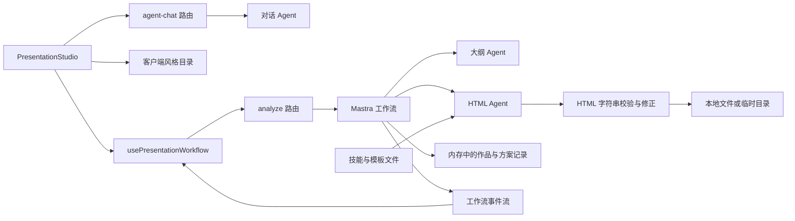
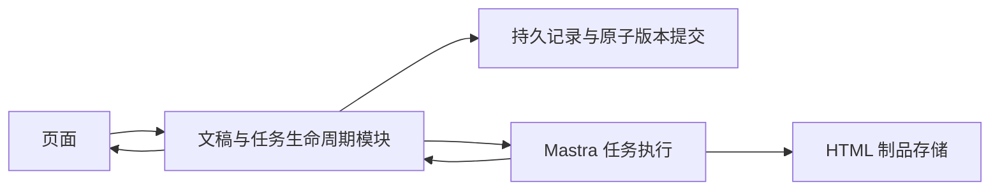
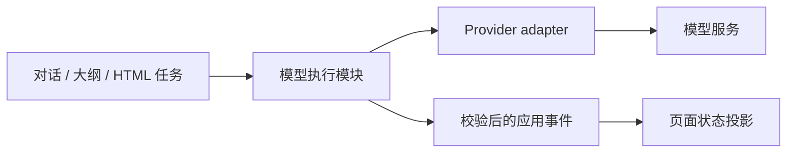
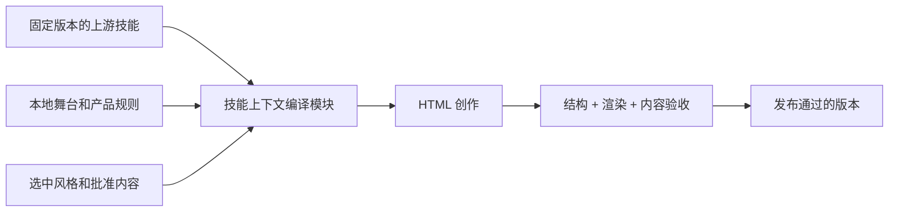
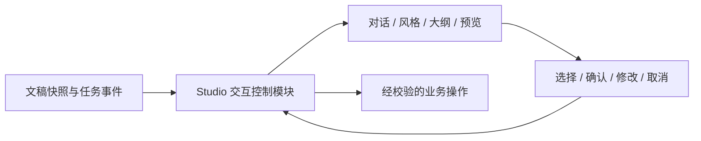

# Presentation Buddy：第一性原理架构与体验审查

日期：2026-09-26。审查基线：`d053fb0`，包含本次工作区修复。本文区分已复现问题、源码推断、已落地修复和后续设计方向；不把建议写成已完成。

## 1. 产品最小目标与不可破坏的约束

用户要的是一份内容可信、风格符合选择、可以继续修改和交付的演示文稿。聊天、Agent、Workflow、HTML 都是实现手段。

从这个目标推导出六条约束：

1. **用户选择必须贯穿生成。** 用途、内容密度、已选风格、批准的大纲不能在模块间传递时丢失。
2. **预览不等于结果。** 流式片段可以不完整；进入审核和发布的数据必须完整且通过校验。
3. **确认必须绑定具体对象。** 确认某份大纲、某个版本或某条修改方案，不能只依赖一句自然语言和若干布尔值。
4. **生成成功意味着可以找回。** 刷新页面、服务重启或切换实例后，已确认内容和已发布版本仍应可恢复。
5. **模型负责创作，代码负责执行约束。** 执行、取消、版本递增、发布和状态恢复不能交给模型猜测。
6. **设计不能创造事实。** 没有提供的指标、客户案例和实验结论应标为待补充或建议。

当前最值得优化的是上述约束的实现，而不是继续增加 Agent、把大文件机械拆小或更换框架。

## 2. frontend-slides 应该如何进入产品

参考：[上游项目](https://github.com/zarazhangrui/frontend-slides)、本地 `.claude/skills/frontend-slides/SKILL.md`。

上游强调视觉比较、独特的设计、单文件 HTML、按阶段加载参考资料。它面向能读文件、运行工具、浏览预览的编码 Agent。把整个技能拼成一段提示词，只保留了指令，没有自动获得工具执行、视觉验收和事实验证能力。

本地技能明确改成 full-viewport；本次读取的上游 README 仍描述固定 16:9。这是已有的产品取舍，本次保留。后续应记录上游版本及本地补丁，避免升级时把两套舞台规则混在一起。

建议保留的能力：

- 一次收集用途、受众、长度、内容准备程度、密度；已有信息不重复问。
- 三种视觉方向，而不是要求用户描述字体和 CSS。
- 选定风格后只加载相关设计规则。
- 单文件 HTML、导航、减少动画模式和完整性校验。

需要产品自己实现的能力：

- 确认记录、任务状态、取消、恢复、版本历史和内容来源。
- 根据实际浏览器渲染检查溢出、可读性、布局和交互。
- 说明风格样例与用户真实标题页的区别。

## 3. 当前系统地图与变更热点

最近 100 条提交中，`presentation-studio.tsx` 被修改 39 次，主工作流 29 次，`agent-panel.tsx` 20 次，`analyze/route.ts` 19 次，`agent-chat/route.ts` 16 次。热点与用户最近遇到的问题一致。

审查开始时，Studio 约 1,214 行，包含 18 个 `useState` 和 6 个 `useRef`；主工作流约 987 行。行数本身不是缺陷，真正的问题是：同一个操作的意图、任务状态、版本和确认规则分散在页面、Hook、两个路由、Workflow 和内存 Map 中。

## 4. 已确认的问题与处理状态

| 优先级 | 问题及证据 | 对用户的影响 | 本次状态 |
| --- | --- | --- | --- |
| P0 | `analyze/route.ts` 启动时重新挑选六个字段，遗漏 `styleSpec`、`density`、`purpose`、`contentReadiness` | 选好的视觉系统和阅读密度没有可靠进入生成 | 已改为转发完整校验结果；两个 HTTP 边界回归测试 |
| P0 | Hook 仅凭 run ID 开启确认，并取 steps 的最后一个属性推断暂停步骤 | 草稿过早可确认、步骤顺序改变后找不到大纲 | 已按步骤 ID 定位暂停数据、校验完整大纲并限制确认时机；五项回归测试 |
| P0 | 测试只提供“留存率提升”，大纲却生成 `52.4% → 78.1%`、`41.2%` 等具体数字 | 生成的报告看起来专业，但事实不可信 | 已增加大纲/HTML 内容约束；新进程真实调用改为“待补充”数值。仍需事实来源校验，不能宣称根治幻觉 |
| P0 | `skill-loader.ts` 将请求中的 `designMd` 直接拼接进文件路径 | 路径穿越可把技能目录外文件读入模型上下文 | 已限制目录边界；使用人工测试文件复现并验证拒绝，不读取真实敏感文件 |
| P1 | `Promise.race` 中每次读取都调用不清理的 `timeoutAfter` | 长流积累定时器，资源占用与错误定位变差 | 已统一为可清理的超时等待；成功、失败、停滞及连续 100 次读取测试通过 |
| P1 | 风格区承诺“按当前主题生成标题页”，实际返回静态 `/style-previews/<id>.svg` | 样例与承诺不一致，用户误判成片内容 | 已改为真实的“风格样例”文案，并为选中按钮加入 `aria-pressed` |
| P1 | 大纲审核把所有信息连成 notes 并 `line-clamp-4` | 未看完整内容就被要求批准 | 已分开显示目的和完整要点，版式建议可展开 |
| P0 | Mastra 使用 `:memory:`；作品和方案保存在进程全局 Map；页面仅有 React 状态 | 刷新无法回到成片，实例切换丢确认和版本约束 | 已在自建测试标签页复现刷新回到空白入口；待持久化改造 |
| P0 | 内存中找不到作品即放行版本冲突检查；方案不存在时仍允许发布 | 多实例条件下不能保证取消后不发布、旧版本不覆盖 | 源码确认；待原子版本提交和方案执行状态持久化 |
| P1 | API `maxDuration=300`，HTML 单次内部超时生产环境为 `420s × 1.5 = 630s`，还可能重试 | 平台可能先终止请求，页面仍显示等待 | 配置矛盾已确认；待统一预算与持久后台任务 |
| P1 | 选风格后需输入确认；聊天可先生成一份文字大纲，实际工作流又生成另一份并再次确认 | 重复确认、重复调用、确认对象不明确 | 已实测；待将阶段按钮与服务端状态绑定 |
| P1 | 仅靠正则和 CSS 字符串检查验收 HTML | 无法证明内容没有溢出、字体可读或导航可用 | 待 DOM/浏览器视觉验收 |
| P1 | `srcDoc` 同时启用 `allow-scripts allow-same-origin` | 生成脚本与应用缺少足够的浏览器隔离 | 源码确认；需在隔离策略与编辑/下载需求之间明确契约 |

补充：格式错误、Schema 错误、事实错误和布局错误是不同类别。通过 JSON Schema 只能证明形状正确，不能证明数据真实；添加风格标识和 CSS 变量只能证明存在契约标记，不能证明视觉还原。

## 5. 浏览器体验审查

本次使用 Chrome 的独立测试标签页走流程，原有用户文稿标签页未刷新、未更改。截图保存在 `/private/tmp/presentation-buddy-review-20260926/`，可视化报告内嵌原图。

| 步骤 | 健康度 | 本次直接观察 |
| --- | --- | --- |
| 1. 新用户入口 | 基本可用 | 主题输入和示例清楚；左侧大面积空白，没有展示接下来需要哪些决策 |
| 2. 需求收集 → 风格选择 | 可用，但承诺有偏差 | 3 页复盘请求触发三张样例；样例文字与复盘无关；文案已修正 |
| 3. 选择风格 → 确认 | 摩擦明显 | 点选后还需输入确认；模型生成文字大纲与真实大纲任务之间缺少清晰界限 |
| 4. 大纲审核 | 已改善 | 修改前要点被截断；修改后完整显示并可展开版式建议；确认按钮保持可用 |
| 5. 生成 → 预览 | 主链路通过 | 三页测试文稿成功完成，预览和下载 HTML 按钮出现；页面仍暴露英文技术过程描述 |
| 6. 刷新恢复 | 未通过 | 测试成片刷新后回到新建入口，缺少文稿 URL、会话恢复与版本列表 |

可访问性：新增选中态语义；审核细节使用原生 details/summary。此次没有执行屏幕阅读器、完整键盘路径、色彩对比自动检查或手机布局审查，不能宣称可访问性达标。

测试文稿用于复现，不是可交付的业务报告。截图中的数值属于修复前模型编造内容，不能作为真实业务数据使用。新进程的大纲验证出现数值占位，但仍可补充未经证实的定性细节，因此内容来源验证仍是后续必做项。

## 6. 四个值得深化的模块

### A. 文稿与任务生命周期：最优先

**目前：** 页面状态、工作流状态、版本 Map、方案 Map 各自维护真相。模型回复和页面条件判断承担了过多执行规则。

**方向：** 文稿/版本/确认记录/任务由一个有持久存储的生命周期模块维护。页面展示状态投影；Mastra 执行已确认任务；任何发布都检查预期版本与当前执行尝试。

关键验收：刷新恢复同一文稿；双击确认只启动一次；取消的执行不能发布；两个实例同时修改只能有一个版本提交成功；原版本始终可以打开。

部署选择未确定：单机容器可先用持久数据库与挂载卷；多实例/无服务器应使用共享数据库和对象存储。不要把切换到本地 SQLite 当成对所有部署场景的解决方案。

### B. 模型任务执行与事件适配：强烈建议

**目前：** Provider 配置、JSON 注入、流式读取、错误判断、超时和重试散布于路由和工作流。UI 直接理解 Mastra 的多种事件形状。

**方向：** 一个执行模块封装 Provider 能力和模型调用；分别处理草稿事件、验证结果、取消和失败。对话、大纲、HTML 复用该能力，业务模块不直接猜测 SDK chunk 结构。

事件应有操作/任务关联及明确顺序；草稿允许缺字段，完成事件必须通过 Schema。总预算应包含启动、首段等待、流式读取、校验和允许的重试，并能实际终止底层调用。

安装版本中存在多个 AI SDK 代际：顶层 `ai=5.0.210`，`@ai-sdk/react=3.0.222` 依赖 `ai=6.0.220`，OpenAI provider 为 v3，Mastra core 还包含 v1/v2 适配，Mastra AI SDK 对接 v5。它不自动证明当前运行一定有问题，但 `as never` 正在掩盖边界不匹配。应在适配模块建立兼容性测试，再做独立版本对齐，避免与状态重构同时大升级。

### C. 技能资源编译与成片验收：强烈建议

**目前：** 每次成片请求固定加载五份文档，共 53,742 个字符，尚未计入大纲和选中的完整模板。技能仍夹带交互、转换、分享等与当前 headless 任务无关的阶段。通过尾部覆盖指令协调本地 viewport 与上游 fixed-stage 差异。

**方向：** 保留技能来源及版本，将阶段规则、项目适配和选中设计契约分开管理；按用途编译上下文。把字体、色板、舞台、导航等确定性要求交给代码契约，模型重点负责内容组织和布局。

不要直接删除大量规则追求少 token。先保留一组代表性文稿作质量基线，再比较上下文长度、首段延迟、总 token、重试率、内容完整率和视觉失败率。53,742 是字符数，不是 token 数；本次未测出可靠的延迟/成本收益。

事实来源应从输入到大纲再到 HTML 保留“用户提供 / 待确认 / 明确示例”的区别。局部内容修订需要保留未修改页的材料，而不仅是提示词里说“不要改”；目前按完整大纲重生成无法保证其他页逐字或视觉不变。

### D. Studio 的交互控制：值得推进

**目前：** 1,200 多行页面同时处理模型协议、任务取消、确认、重试、版本、风格及渲染。多个 useState/useRef 组合可以形成不存在的业务状态。

**方向：** 先明确状态所有权，再收敛为任务驱动的页面状态和有限 UI 状态。聊天消息是操作说明，不是持久业务状态；状态跃迁由服务端任务事实决定。

先迁移一条“需求 → 选风格 → 大纲审核 → 生成”路径，再迁移修改和重试。不要一次把全部状态搬进 reducer 而保留原有重复判断；那只会把复杂度换个文件。

## 7. 推荐交互目标

1. 一次补齐需求，随时可更改。
2. 展示三种明确标为样例的风格；后续再升级为真实主题标题页。
3. 选定后通过明确的“生成大纲”操作进入任务，不要求模型再理解固定按钮的意思。
4. 在同一份完整大纲上审核一次；未知数据显式显示待补充。
5. 生成时说明正在做什么、是否仍活跃、能否取消；不把字符数映射的百分比写成精确完成度。
6. 完成后得到可恢复的文稿地址、版本和导出入口。
7. 修改时显示影响范围；成功才切换到新版本，失败保留旧版本。

## 8. 迁移顺序与验收

| 阶段 | 目标 | 验收条件 |
| --- | --- | --- |
| 本次 | 修复已证实的数据边界与审核问题 | 新增回归测试通过；主流程保持可用；详见第 4 节 |
| 下一阶段 A | 文稿身份、持久任务/版本/确认 | 刷新恢复、重启恢复、并发提交与取消后禁止发布测试 |
| 下一阶段 B | 统一执行、事件和预算 | Provider 契约测试、断流恢复、总预算、重复事件和晚到事件测试 |
| 下一阶段 C | 阶段化技能上下文和内容/渲染验收 | 选中风格贯穿、未知指标不变事实、桌面和手机布局、页数及导航检查 |
| 下一阶段 D | 简化 Studio 和确认交互 | 不重复询问、固定动作不调用分类模型、修改/重试不污染当前版本 |

不建议本轮同时换 Agent 框架、升级全部 AI SDK、引入微服务或重写所有 UI。它们不能直接修复已确认的契约问题，会使回归归因更困难。

建议跟踪的指标：首次可用文稿成功率、首次可审大纲耗时、文稿总耗时及 token、重试比例、刷新恢复成功率、无来源事实数、浏览器布局缺陷数、从需求到成片的人工确认次数。先记录基线，再设数值目标。

## 9. 本次验证与边界

- 自动测试：33 个测试文件、202 项测试通过；本次新增 13 项行为回归测试。
- TypeScript、修改文件 ESLint 与生产构建检查均通过。
- 浏览器：需求、风格选择、大纲审核、三页 HTML 生成与预览成功；刷新恢复失败已记录。
- 新进程真实模型验证：数值缺失改成占位符；事实可靠性仍需独立验证。
- 生产构建出现既有工作区根目录推断和 Mastra 遥测配置警告，未通过隐藏日志规避。
- 开发环境 Mastra 单例会保留旧 Agent；修改 Agent 指令后需重启开发服务才会用于新的浏览器任务。测试中的新进程验证使用了最新指令。
- 未在本次完成共享数据库、后台任务、版本历史、跨实例并发压测或完整视觉回归。

可视化报告：`/private/tmp/architecture-review-presentation-buddy-20260926.html`。报告包含本次截图与四个模块的改造前后示意，HTML 本体位于临时目录，不进入仓库。

报告图片已嵌入 HTML，结构检查通过。浏览器策略拒绝打开本地 `file://` 报告，因此本次未完成报告自身的浏览器渲染复核；上文产品体验截图均已实际查看。
